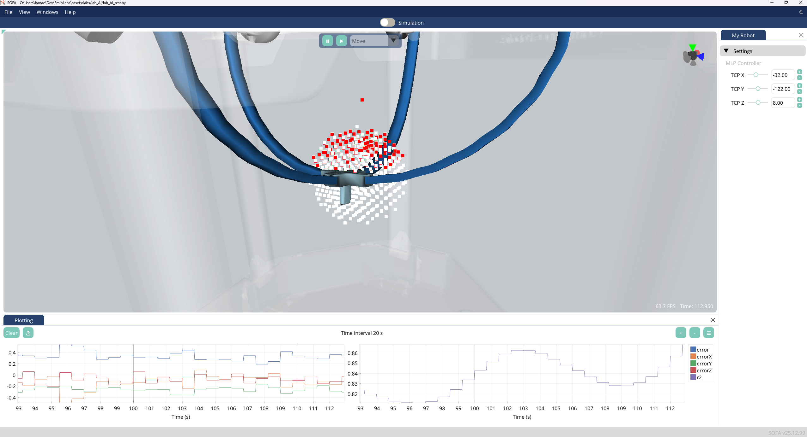

# Emio.lab_AI
The goal of this lab is to build a multilayer perceptron (MLP) to predict the the Emio's motors angles from the end-effector position (inverse kinematics).

It porposes to implement the MLP using three different approaches:
- from scratch using numpy,
- using Scikit-learn,
- using PyTorch.

For each approach, you will:
- load and preprocess the dataset,
- build the MLP,
- train the MLP,
- evaluate the MLP.

## Datasets
The datasets used in this lab are in CSV files containing the motors angles and the corresponding end-effector positions of Emio. The datasets are located in the `data/results` folder and has been generated using the SOFA simulation of Emio `lab_AI_dataset_generation.py`.

You can use the scene to generate your own dataset by modifying the distance ratio between the sample points and the shape of the workspace (cube or sphere).

### Datasets with real positions
We generated a dataset, not by using the positions from the simulation, but by tracking the robot's TCP position with a Polhemus magnetic tracker.
We generated both a cube and a sphere dataset in the `result` folder: `blueleg_beam_real_cube2197.csv` and  `blueleg_beam_real_cube2197.csv`.

If you want to learn the physical robot model, you can use these datasets for the training.
These datasets have an extra column `Real Position` with the recorded tracked position.
To use them, you have to modify the code 

## Build your own MLP
You will build a multilayer perceptron (MLP) with two hidden layers of 128 neurons each. The input layer will have 3 neurons (the x, y, z coordinates of the end-effector position) and the output layer will have 4 neurons (the 4 motors angles).

The activation function used in the hidden layers is the logistic function and there is no activation function in the output layer.

Each methods of building the MLP will be presented in a separate section:
- from scratch using numpy: `sections/2_from_scratch.md`
- using Scikit-learn: `sections/3_scikit-learn.md`
- using PyTorch: `sections/4_pytorch.md`

## Training
To train your models, use the provided `train_model.py` script. This script allows you to select the desired approach (numpy, scikit-learn, or PyTorch) and specify the dataset to use.

### Training Instructions

1. Open a terminal and navigate to the lab directory.
2. Run the training script with the appropriate arguments. For example:
    ```bash
    python train_model.py <model_type> <dataset_path> <OPTIONAL: learn from rea data>
    ```
    - `model_type`: Choose between `custom`, `scikit-learn`, or `pytorch`.
    - `dataset_path`: Path to your dataset CSV file.
    - The path to where the model is saved is `data/results/model_MODEL_TYPE.ext`
        - pytorch will save a `pth` file
        - scikit-learn and custom will save `joblib` files
    - `learn_from_real`: Optional boolean to look for `Real Position` column in the dataset. Default is `False`

3. The script will preprocess the data, build the MLP, train it, and save the trained model to the specified location.


## Evaluation of the model 

### Without SOFA
1. Open a terminal and navigate to the lab directory.
2. Run the `evaluate_model.py` script with the appropriate rguments.

```bash
python evaluate_model.py <model_type> <dataset_path> <model_path>
```

- model_type: `custom`, `scikit-learn`, `pytorch`
- dataset_path: `PATH/TO/DATASET`
    - pytorch expects `pth` files
    - scikit-learn and custom expct `joblib` files
- model_path: `PATH/TO/MODEL`
    - pytorch expects `pth` files
    - scikit-learn and custom expect `joblib` files
3. This script will return the r2 score of the model based on the dataset.


### With SOFA
Once you have trained your model, you can use it in the SOFA scene to control the robot. The scene `lab_AI_test.py` is already set up to use your trained model. You just need to specify the path to your model file in the scene.

The effector will then move to the different tagerts sampled along the sphere or cube


